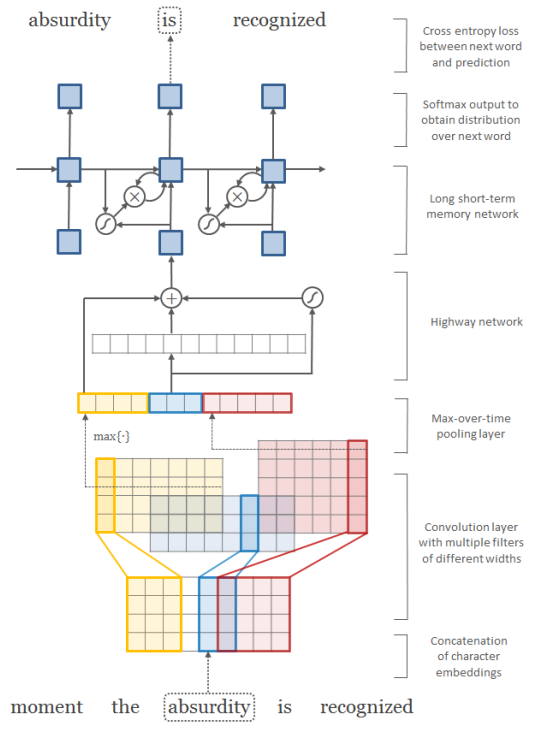

Character-Aware Neural Language Models
======================================

Tensorflow implementation of [Character-Aware Neural Language Models](http://arxiv.org/abs/1508.06615). The original code of author can be found [here](https://github.com/yoonkim/lstm-char-cnn).

This implementation contains:

1. Word-level and Character-level Convolutional Neural Network
2. Highway Network
3. Recurrent Neural Network Language Model

Prerequisites
-------------

- Python 2.7 or Python 3.3+
- [Tensorflow](https://www.tensorflow.org/)

Usage
-----

To train a model with `ptb` dataset:

    $ python main.py --dataset ptb

To test an existing model:

    $ python main.py --dataset ptb --forward_only True

To see all training options, run:

    $ python main.py --help

which will print

    usage: main.py [-h] [--epoch EPOCH] [--word_embed_dim WORD_EMBED_DIM]
                  [--char_embed_dim CHAR_EMBED_DIM]
                  [--max_word_length MAX_WORD_LENGTH] [--batch_size BATCH_SIZE]
                  [--seq_length SEQ_LENGTH] [--learning_rate LEARNING_RATE]
                  [--decay DECAY] [--dropout_prob DROPOUT_PROB]
                  [--feature_maps FEATURE_MAPS] [--kernels KERNELS]
                  [--model MODEL] [--data_dir DATA_DIR] [--dataset DATASET]
                  [--checkpoint_dir CHECKPOINT_DIR]
                  [--forward_only [FORWARD_ONLY]] [--noforward_only]

    optional arguments:
      -h, --help            show this help message and exit
      --epoch EPOCH         Epoch to train [25]
      --word_embed_dim WORD_EMBED_DIM
                            The dimension of word embedding matrix [650]
      --char_embed_dim CHAR_EMBED_DIM
                            The dimension of char embedding matrix [15]
      --max_word_length MAX_WORD_LENGTH
                            The maximum length of word [65]
      --batch_size BATCH_SIZE
                            The size of batch images [32]
      --seq_length SEQ_LENGTH
                            The # of timesteps to unroll for [35]
      --learning_rate LEARNING_RATE
                            Learning rate [1.0]
      --decay DECAY         Decay of RMSProp [0.5]
      --dropout_prob DROPOUT_PROB
                            Probability of dropout layer [0.5]
      --feature_maps FEATURE_MAPS
                            The # of feature maps in CNN
                            [50,100,150,200,200,200,200]
      --kernels KERNELS     The width of CNN kernels [1,2,3,4,5,6,7]
      --model MODEL         The type of model to train and test [LSTM, LSTMTDNN]
      --data_dir DATA_DIR   The name of data directory [data]
      --dataset DATASET     The name of dataset [ptb]
      --checkpoint_dir CHECKPOINT_DIR
                            Directory name to save the checkpoints [checkpoint]
      --forward_only [FORWARD_ONLY]
                            True for forward only, False for training [False]
      --noforward_only

but more options can be found in [models/LSTMTDNN](./models/LSTMTDNN.py) and [models/TDNN](./models/TDNN.py).

Performance
-----------

The perplexity on the test sets of Penn Treebank corpora.

(in progress)

Author
------

Taehoon Kim / [@carpedm20](http://carpedm20.github.io/)
